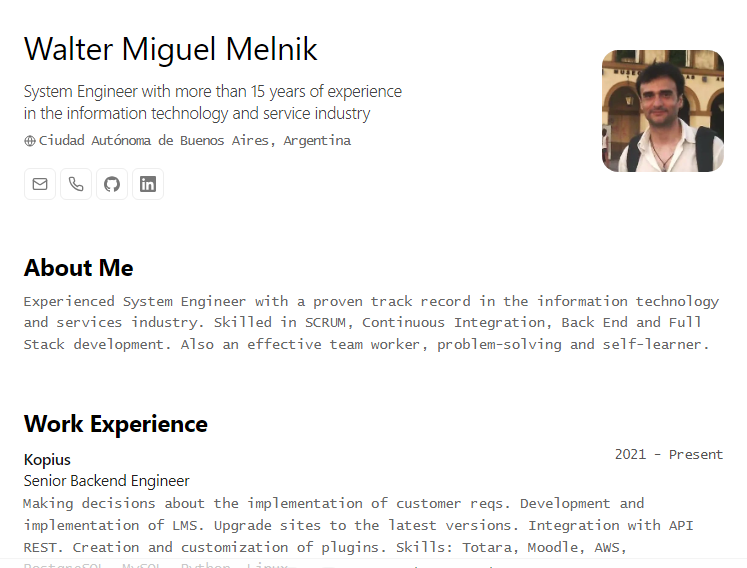

<div align="center">
 
<h2>
    Portfolio minimalista maquetado para web y pdf
</h2>
<p>
Esquema del JSON de CV de <a href="https://jsonresume.org/schema/">jsonresume.org</a>
</p>


<p>
Basado en el diseño de <a href="https://github.com/BartoszJarocki/cv">Bartosz Jarocki</a>
y en las modificaciones de <a href="https://github.com/midudev/minimalist-portfolio-json">Miguel Ángel Durán</a>
</p>

</div>

<div align="center">
    <a href="#🚀-empezar">
        Empezar
    </a>
    <span>&nbsp;✦&nbsp;</span>
    <a href="#🧞-comandos">
        Comandos
    </a>   
</div>

<p></p>

</img>

## 🛠️ Stack

- [**Astro**](https://astro.build/) - El framework web de la nueva época.
- [**Typescript**](https://www.typescriptlang.org/) - JavaScript con sintaxis de tipado.
- [**Ninja Keys**](https://github.com/ssleptsov/ninja-keys) - Menu desplegable con atajos de teclado hecho en puro Javascript.


## 🚀 Empezar

### 1. Instala Astro

```bash
# Instala Astro
cd portfolio-json
npm install astro
```

### 2. Añade tu contenido:
Edita el archivo `cv.json` para crear tu propio Portafolio/CV imprimible.
### 3. Lanza el servidor de desarrollo:

```bash
# Disfruta del resultado
npm start
```


Abre [**http://localhost:4321**](http://localhost:4321/) en tu navegador para ver el resultado 🚀


## 🧞 Comandos

|     | Comando          | Acción                                        |
| :-- | :--------------- | :-------------------------------------------- |
| ⚙️  | `dev` o `start` | Lanza un servidor de desarrollo local en  `localhost:4321`.  |
| ⚙️  | `build`          | Comprueba posibles errores y hace un empaquetado de producción en `./dist/`.      |
| ⚙️  | `preview`        | Vista previa en local `localhost:4321` |

